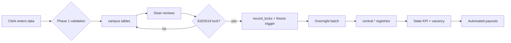

# NE-EMIS Architecture

## 1. Topology

```text
            Campus A               Campus B                 State
        ┌──────────────┐        ┌──────────────┐        ┌────────────────┐
        │ clerk       │        │ clerk       │        │ state_admin    │
        │ dean  → MID │        │ dean  → MID │        │ aggregator     │
        └──────┬───────┘        └──────┬───────┘        └───────┬────────┘
               │ campus RLS            │ campus RLS            │ central RLS
               ▼                       ▼                       ▼
    ┌─────────────────────────────────────────────────────────────────────┐
    │            PostgreSQL 15+                                            │
    │  public.*  (tenant-owned: students, teachers, attendance, ...)      │
    │  central.* (state-owned: student_registry, teacher_registry, KPIs,  │
    │            funding_payouts)                                         │
    │  app.*     (RLS helper functions, immutable ID generators)          │
    └─────────────────────────────────────────────────────────────────────┘
```

## 2. Tenant isolation

Every tenant table carries `campus_id`. On each API request the backend sets:

```sql
SELECT set_config('neemis.campus_id', :campus_id, true);
SELECT set_config('neemis.role', :role, true);
SELECT set_config('neemis.user_id', :user_id, true);
```

The policy on each tenant table is:

```sql
USING (campus_id = app.current_campus_id() OR app.is_state_role())
WITH CHECK (campus_id = app.current_campus_id() OR app.is_state_role())
```

So a clerk can only read/write their own campus; `state_admin`, `system`
and `aggregator` roles can access central state tables through the RLS policy.

## 3. Identifier generation

All global identifiers are generated *inside the database* by triggers so no
application code can set or rewrite them:

| Trigger | Table | Produces |
|---|---|---|
| `trg_students_gen_sid` | `students` | `NE-SID-<hex-uuid>` |
| `trg_teachers_gen_tid` | `teachers` | `NE-TID-<hex-uuid>` |
| `trg_managers_gen_mid` | `managers` | `NE-MID-<hex-uuid>` |
| `trg_sections_gen_cid` | `course_sections` | `NE-CID-<STATE>-<SECTION>-<hex-uuid>` |

## 4. Module map

```
app/core/crypto_lock.py        Ed25519 envelope signing/hashing
app/services/locking.py        Phase 2 lock/unlock orchestration
app/services/ingestion.py      Phase 1 validation + persistence helpers
app/services/aggregation.py    Phase 3 central registry builders
app/services/state_control.py  Phase 4 KPIs, vacancies, payouts
```

## 5. Data flow



## 6. Failure handling

- Validation rejects bad rows before any write (real-time rules).
- Batch aggregation is idempotent by `snapshot_key`.
- Record freeze raises `neemis.record_locked` (SQLSTATE `55000`) on tamper
  attempts.
- State unlock requires a role permitted by `STATE_UNLOCK_ROLES` plus a
  counter-signature.
